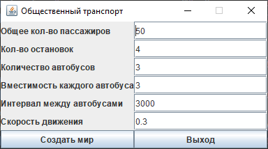

# MultiThreadingTask

Общественный транспорт

По маршруту с остановками ходят автобусы (количество варьируется, вместимость тоже может быть разная)
с одинаковой скоростью, и переменными интервалами между автобусами.
Каждый автобус - отдельный поток.

На остановки приходят пассажиры и в конкурентном порядке пытаются попасть в автобус, одновременно в автобус может зайти только 1 человек (доп. задание N=1-4 человек), едут до своей остановки , выходят.
Каждый поссажир - отдельный поток.
Пассажир после приходя на остановку переходит в состояние wait, и выходит их него по приезду автобуса на остановку.
Если пассажир не смог попасть в автобус, он опять переходит в состояние Wait до следующего.
В начале работы приложения генерируются все потоки пассажиры расставленные случайным образом по всем остановкам.

Когда поток-автобус на остановке и там есть пассажиры он должен переходить в состояние wait и выходить из этого состояния при условии что пора двигаться дальше.
Условия дальнейшего движения - пассажиров на остановке больше нет, свободных мест в автобусе больше нет.
Пассажир садится только в автобус, который идет в нужную ему сторону.
(вариант реализации - разделение остановок по направлениям и т.о. когда автобус едет в одну сторону, он останавливается на одних остановках, когда обратно - то на других)

В начале работы приложения автобус выходит из конечной остановки №1 и движется с постоянной скоростью по по маршруту. Через заданный интервал с конечной №1 выходит следующий и т.д.
Когда автобус до конечной №2 - он едет обратно. (У автобуса как характеристика внутреннего состояния может быть его координата на временной оси в минутах, помимо его положения в пространстве)
На конечных остановках пассажиры могут не выходить, если они еще не доехали до нужной остановки. (т.о. задау можно свести к движению по кругу)

Потоки автобусы и потоки пассажиры ничего не должны "знать" друг о друге. (т.е. у автобуса нет переменных, указывающих на объекты-потоки, известно только количество пассажиров внутри)

В главном потоке выполняется т.н. Контроллер, который создает и запускает потоки-пассажиры и потоки-автобусы, но при этом не хранит у себя никаких ссылок на эти объекты.
Так же можно выделить понятие "улица с остановками", по которой автобусы перевозят пассажиров.

Приложение должно работать в 2-х режимах: консоль, графический интерфейс(доп. задание).
При работе в графическом режиме должна быть возможность корректно завершить работу приложения в любое время. Должна быть возможность варьировать скорость движения.
Начальные параметры:
- Режим работы приолжения
- Общее число пассажиров
- Количество остановок в одну сторону (т.о. все остановки парные)
- Количество автобусов
- Вместимость каждого автобуса
- Интервал движения
- Скорость движения

Начальные параметры должны быть получены из файла properties.
В графическом режиме должна быть возможность задавать начальные параметры (кроме режима работы приложения) и должна быть кнопка "Старт", собственно запускающая всю эту движуху.

Логирование Log4j.
Собирать все maven.

Каждый поток (пассажир и автобус) должен логировать все свои действия.

<b style="font-size: 20px">При в ходных параметрах:</b>
 

 
<b style="font-size: 20px">Результат:</b>
 

12:38:21 [INFO ] : Пассажир 0 идёт на остановку №2 хочет доехать до остановки №0 
12:38:21 [INFO ] : Пассажир 1 идёт на остановку №1 хочет доехать до остановки №2 
12:38:21 [INFO ] : Пассажир 2 идёт на остановку №1 хочет доехать до остановки №0 
12:38:21 [INFO ] : Пассажир 3 идёт на остановку №0 хочет доехать до остановки №3 
12:38:21 [INFO ] : Пассажир 4 идёт на остановку №2 хочет доехать до остановки №0 
12:38:21 [INFO ] : Пассажир 5 идёт на остановку №2 хочет доехать до остановки №1 
12:38:21 [INFO ] : Пассажир 6 идёт на остановку №3 хочет доехать до остановки №0 
12:38:21 [INFO ] : Пассажир 7 идёт на остановку №0 хочет доехать до остановки №3 
12:38:21 [INFO ] : Пассажир 8 идёт на остановку №0 хочет доехать до остановки №2 
12:38:21 [INFO ] : Пассажир 9 идёт на остановку №2 хочет доехать до остановки №0 
12:38:21 [INFO ] : Пассажир 10 идёт на остановку №2 хочет доехать до остановки №1 
12:38:21 [INFO ] : Пассажир 11 идёт на остановку №3 хочет доехать до остановки №1 
12:38:21 [INFO ] : Пассажир 12 идёт на остановку №3 хочет доехать до остановки №2 
12:38:21 [INFO ] : Пассажир 13 идёт на остановку №2 хочет доехать до остановки №1 
12:38:21 [INFO ] : Пассажир 14 идёт на остановку №2 хочет доехать до остановки №0 
12:38:21 [INFO ] : Пассажир 15 идёт на остановку №2 хочет доехать до остановки №0 
12:38:21 [INFO ] : Пассажир 16 идёт на остановку №0 хочет доехать до остановки №3 
12:38:21 [INFO ] : Пассажир 17 идёт на остановку №1 хочет доехать до остановки №0 
12:38:21 [INFO ] : Пассажир 18 идёт на остановку №0 хочет доехать до остановки №2 
12:38:21 [INFO ] : Пассажир 19 идёт на остановку №1 хочет доехать до остановки №0 
12:38:21 [INFO ] : Пассажир 20 идёт на остановку №2 хочет доехать до остановки №1 
12:38:21 [INFO ] : Пассажир 21 идёт на остановку №2 хочет доехать до остановки №1 
12:38:21 [INFO ] : Пассажир 22 идёт на остановку №0 хочет доехать до остановки №1 
12:38:21 [INFO ] : Пассажир 23 идёт на остановку №0 хочет доехать до остановки №2 
12:38:21 [INFO ] : Пассажир 24 идёт на остановку №3 хочет доехать до остановки №1 
12:38:21 [INFO ] : Пассажир 25 идёт на остановку №3 хочет доехать до остановки №1 
12:38:21 [INFO ] : Пассажир 26 идёт на остановку №0 хочет доехать до остановки №1 
12:38:21 [INFO ] : Пассажир 27 идёт на остановку №0 хочет доехать до остановки №2 
12:38:21 [INFO ] : Пассажир 28 идёт на остановку №3 хочет доехать до остановки №1 
12:38:21 [INFO ] : Пассажир 29 идёт на остановку №1 хочет доехать до остановки №2 
12:38:21 [INFO ] : Пассажир 30 идёт на остановку №0 хочет доехать до остановки №3 
12:38:21 [INFO ] : Пассажир 31 идёт на остановку №3 хочет доехать до остановки №0 
12:38:21 [INFO ] : Пассажир 32 идёт на остановку №0 хочет доехать до остановки №2 
12:38:21 [INFO ] : Пассажир 33 идёт на остановку №2 хочет доехать до остановки №0 
12:38:21 [INFO ] : Пассажир 34 идёт на остановку №2 хочет доехать до остановки №0 
12:38:21 [INFO ] : Пассажир 35 идёт на остановку №0 хочет доехать до остановки №2 
12:38:21 [INFO ] : Пассажир 36 идёт на остановку №0 хочет доехать до остановки №3 
12:38:21 [INFO ] : Пассажир 37 идёт на остановку №1 хочет доехать до остановки №2 
12:38:21 [INFO ] : Пассажир 38 идёт на остановку №3 хочет доехать до остановки №1 
12:38:21 [INFO ] : Пассажир 39 идёт на остановку №3 хочет доехать до остановки №0 
12:38:21 [INFO ] : Пассажир 40 идёт на остановку №3 хочет доехать до остановки №2 
12:38:21 [INFO ] : Пассажир 41 идёт на остановку №3 хочет доехать до остановки №2 
12:38:21 [INFO ] : Пассажир 42 идёт на остановку №2 хочет доехать до остановки №1 
12:38:21 [INFO ] : Пассажир 43 идёт на остановку №1 хочет доехать до остановки №3 
12:38:21 [INFO ] : Пассажир 44 идёт на остановку №0 хочет доехать до остановки №1 
12:38:21 [INFO ] : Пассажир 45 идёт на остановку №2 хочет доехать до остановки №3 
12:38:21 [INFO ] : Пассажир 46 идёт на остановку №1 хочет доехать до остановки №0 
12:38:21 [INFO ] : Пассажир 47 идёт на остановку №2 хочет доехать до остановки №3 
12:38:21 [INFO ] : Пассажир 48 идёт на остановку №1 хочет доехать до остановки №3 
12:38:21 [INFO ] : Пассажир 49 идёт на остановку №2 хочет доехать до остановки №1 
12:38:21 [INFO ] : Автобус 0 поехал; Мест 3; Скорость 0.3; Маршрут 0 
12:38:21 [INFO ] : Автобус 1 поехал; Мест 3; Скорость 0.3; Маршрут 0 
12:38:21 [INFO ] : Автобус 2 поехал; Мест 3; Скорость 0.3; Маршрут 0 
12:38:21 [INFO ] : Пассажир 0 прибыл на остановку 2; Маршрут 1 
12:38:21 [INFO ] : Пассажир 14 прибыл на остановку 2; Маршрут 1 
12:38:21 [INFO ] : Пассажир 30 прибыл на остановку 0; Маршрут 0 
12:38:21 [INFO ] : Пассажир 31 прибыл на остановку 3; Маршрут 1 
12:38:21 [INFO ] : Пассажир 23 прибыл на остановку 0; Маршрут 0 
12:38:21 [INFO ] : Пассажир 22 прибыл на остановку 0; Маршрут 0 
12:38:21 [INFO ] : Пассажир 21 прибыл на остановку 2; Маршрут 1 
12:38:21 [INFO ] : Пассажир 20 прибыл на остановку 2; Маршрут 1 
12:38:21 [INFO ] : Пассажир 16 прибыл на остановку 0; Маршрут 0 
12:38:21 [INFO ] : Пассажир 19 прибыл на остановку 1; Маршрут 1 
12:38:21 [INFO ] : Пассажир 18 прибыл на остановку 0; Маршрут 0 
12:38:21 [INFO ] : Пассажир 17 прибыл на остановку 1; Маршрут 1 
12:38:21 [INFO ] : Пассажир 4 прибыл на остановку 2; Маршрут 1 
12:38:21 [INFO ] : Пассажир 11 прибыл на остановку 3; Маршрут 1 
12:38:21 [INFO ] : Пассажир 2 прибыл на остановку 1; Маршрут 1 
12:38:21 [INFO ] : Пассажир 13 прибыл на остановку 2; Маршрут 1 
12:38:21 [INFO ] : Пассажир 12 прибыл на остановку 3; Маршрут 1 
12:38:21 [INFO ] : Пассажир 10 прибыл на остановку 2; Маршрут 1 
12:38:21 [INFO ] : Пассажир 3 прибыл на остановку 0; Маршрут 0 
12:38:21 [INFO ] : Пассажир 5 прибыл на остановку 2; Маршрут 1 
12:38:21 [INFO ] : Пассажир 6 прибыл на остановку 3; Маршрут 1 
12:38:21 [INFO ] : Пассажир 7 прибыл на остановку 0; Маршрут 0 
12:38:21 [INFO ] : Пассажир 8 прибыл на остановку 0; Маршрут 0 
12:38:21 [INFO ] : Пассажир 9 прибыл на остановку 2; Маршрут 1 
12:38:21 [INFO ] : Пассажир 1 прибыл на остановку 1; Маршрут 0 
12:38:21 [INFO ] : Пассажир 45 прибыл на остановку 2; Маршрут 0 
12:38:21 [INFO ] : Пассажир 44 прибыл на остановку 0; Маршрут 0 
12:38:21 [INFO ] : Пассажир 43 прибыл на остановку 1; Маршрут 0 
12:38:21 [INFO ] : Пассажир 42 прибыл на остановку 2; Маршрут 1 
12:38:21 [INFO ] : Пассажир 41 прибыл на остановку 3; Маршрут 1 
12:38:21 [INFO ] : Пассажир 37 прибыл на остановку 1; Маршрут 0 
12:38:21 [INFO ] : Пассажир 35 прибыл на остановку 0; Маршрут 0 
12:38:21 [INFO ] : Пассажир 40 прибыл на остановку 3; Маршрут 1 
12:38:21 [INFO ] : Пассажир 38 прибыл на остановку 3; Маршрут 1 
12:38:21 [INFO ] : Пассажир 36 прибыл на остановку 0; Маршрут 0 
12:38:21 [INFO ] : Пассажир 39 прибыл на остановку 3; Маршрут 1 
12:38:21 [INFO ] : Пассажир 33 прибыл на остановку 2; Маршрут 1 
12:38:21 [INFO ] : Пассажир 34 прибыл на остановку 2; Маршрут 1 
12:38:21 [INFO ] : Пассажир 26 прибыл на остановку 0; Маршрут 0 
12:38:21 [INFO ] : Пассажир 28 прибыл на остановку 3; Маршрут 1 
12:38:21 [INFO ] : Пассажир 29 прибыл на остановку 1; Маршрут 0 
12:38:21 [INFO ] : Пассажир 27 прибыл на остановку 0; Маршрут 0 
12:38:21 [INFO ] : Пассажир 25 прибыл на остановку 3; Маршрут 1 
12:38:21 [INFO ] : Пассажир 15 прибыл на остановку 2; Маршрут 1 
12:38:21 [INFO ] : Пассажир 32 прибыл на остановку 0; Маршрут 0 
12:38:21 [INFO ] : Пассажир 24 прибыл на остановку 3; Маршрут 1 
12:38:21 [INFO ] : Пассажир 47 прибыл на остановку 2; Маршрут 0 
12:38:21 [INFO ] : Пассажир 48 прибыл на остановку 1; Маршрут 0 
12:38:21 [INFO ] : Пассажир 49 прибыл на остановку 2; Маршрут 1 
12:38:21 [INFO ] : Пассажир 46 прибыл на остановку 1; Маршрут 1 
12:38:25 [INFO ] : Автобус 0 начал новый круг 
12:38:28 [INFO ] : |В-->| Автобус 0 приехал на остановку №0; Пассажиров 0; Мест 3; Маршрут 0 
12:38:28 [INFO ] : Пассажир 30 сел в автобус 0 Сел на остановке 0 
12:38:28 [INFO ] : Пассажир 32 сел в автобус 0 Сел на остановке 0 
12:38:28 [INFO ] : Пассажир 27 сел в автобус 0 Сел на остановке 0 
12:38:28 [INFO ] : Автобус 1 начал новый круг 
12:38:31 [INFO ] : |В-->| Автобус 0 приехал на остановку №1; Пассажиров 3; Мест 0; Маршрут 0 
12:38:31 [INFO ] : |В-->| Автобус 1 приехал на остановку №0; Пассажиров 0; Мест 3; Маршрут 0 
12:38:31 [INFO ] : Пассажир 26 сел в автобус 1 Сел на остановке 0 
12:38:31 [INFO ] : Пассажир 23 сел в автобус 1 Сел на остановке 0 
12:38:31 [INFO ] : Пассажир 22 сел в автобус 1 Сел на остановке 0 
12:38:31 [INFO ] : Автобус 2 начал новый круг 
12:38:33 [INFO ] : |В-->| Автобус 0 приехал на остановку №2; Пассажиров 3; Мест 0; Маршрут 0 
12:38:33 [INFO ] : Пассажир 32 вышел из автобуса 0 Вышел на остановке 2 
12:38:33 [INFO ] : Пассажир 27 вышел из автобуса 0 Вышел на остановке 2 
12:38:34 [INFO ] : |В-->| Автобус 1 приехал на остановку №1; Пассажиров 3; Мест 0; Маршрут 0 
12:38:34 [INFO ] : Пассажир 26 вышел из автобуса 1 Вышел на остановке 1 
12:38:34 [INFO ] : Пассажир 43 сел в автобус 1 Сел на остановке 1 
12:38:34 [INFO ] : Пассажир 22 вышел из автобуса 1 Вышел на остановке 1 
12:38:34 [INFO ] : Пассажир 37 сел в автобус 1 Сел на остановке 1 
12:38:34 [INFO ] : |В-->| Автобус 2 приехал на остановку №0; Пассажиров 0; Мест 3; Маршрут 0 
12:38:34 [INFO ] : Пассажир 16 сел в автобус 2 Сел на остановке 0 
12:38:34 [INFO ] : Пассажир 36 сел в автобус 2 Сел на остановке 0 
12:38:34 [INFO ] : Пассажир 35 сел в автобус 2 Сел на остановке 0 
12:38:36 [INFO ] : |В-->| Автобус 0 приехал на остановку №3; Пассажиров 1; Мест 2; Маршрут 0 
12:38:36 [INFO ] : Пассажир 30 вышел из автобуса 0 Вышел на остановке 3 
12:38:36 [INFO ] : Автобус 0 приехал на конечную 
12:38:36 [INFO ] : Автобус 0 разворачивается и едет по обратному маршруту 
12:38:36 [INFO ] : |<--Н| Автобус 0 приехал на остановку №3; Пассажиров 0; Мест 3; Маршрут 1 
12:38:36 [INFO ] : Пассажир 31 сел в автобус 0 Сел на остановке 3 
12:38:36 [INFO ] : Пассажир 24 сел в автобус 0 Сел на остановке 3 
12:38:36 [INFO ] : Пассажир 25 сел в автобус 0 Сел на остановке 3 
12:38:37 [INFO ] : |В-->| Автобус 2 приехал на остановку №1; Пассажиров 3; Мест 0; Маршрут 0 
12:38:37 [INFO ] : |В-->| Автобус 1 приехал на остановку №2; Пассажиров 3; Мест 0; Маршрут 0 
12:38:37 [INFO ] : Пассажир 23 вышел из автобуса 1 Вышел на остановке 2 
12:38:37 [INFO ] : Пассажир 47 сел в автобус 1 Сел на остановке 2 
12:38:37 [INFO ] : Пассажир 37 вышел из автобуса 1 Вышел на остановке 2 
12:38:38 [INFO ] : |<--Н| Автобус 0 приехал на остановку №2; Пассажиров 3; Мест 0; Маршрут 1 
12:38:39 [INFO ] : |В-->| Автобус 2 приехал на остановку №2; Пассажиров 3; Мест 0; Маршрут 0 
12:38:39 [INFO ] : Пассажир 35 вышел из автобуса 2 Вышел на остановке 2 
12:38:40 [INFO ] : |В-->| Автобус 1 приехал на остановку №3; Пассажиров 2; Мест 1; Маршрут 0 
12:38:40 [INFO ] : Автобус 1 приехал на конечную 
12:38:40 [INFO ] : Пассажир 43 вышел из автобуса 1 Вышел на остановке 3 
12:38:40 [INFO ] : Автобус 1 разворачивается и едет по обратному маршруту 
12:38:40 [INFO ] : Пассажир 47 вышел из автобуса 1 Вышел на остановке 3 
12:38:40 [INFO ] : |<--Н| Автобус 1 приехал на остановку №3; Пассажиров 0; Мест 3; Маршрут 1 
12:38:40 [INFO ] : Пассажир 28 сел в автобус 1 Сел на остановке 3 
12:38:40 [INFO ] : Пассажир 11 сел в автобус 1 Сел на остановке 3 
12:38:40 [INFO ] : Пассажир 12 сел в автобус 1 Сел на остановке 3 
12:38:41 [INFO ] : |<--Н| Автобус 0 приехал на остановку №1; Пассажиров 3; Мест 0; Маршрут 1 
12:38:41 [INFO ] : Пассажир 24 вышел из автобуса 0 Вышел на остановке 1 
12:38:41 [INFO ] : Пассажир 25 вышел из автобуса 0 Вышел на остановке 1 
12:38:41 [INFO ] : Пассажир 46 сел в автобус 0 Сел на остановке 1 
12:38:41 [INFO ] : Пассажир 2 сел в автобус 0 Сел на остановке 1 
12:38:42 [INFO ] : |В-->| Автобус 2 приехал на остановку №3; Пассажиров 2; Мест 1; Маршрут 0 
12:38:42 [INFO ] : Пассажир 16 вышел из автобуса 2 Вышел на остановке 3 
12:38:42 [INFO ] : Автобус 2 приехал на конечную 
12:38:42 [INFO ] : Автобус 2 разворачивается и едет по обратному маршруту 
12:38:42 [INFO ] : Пассажир 36 вышел из автобуса 2 Вышел на остановке 3 
12:38:42 [INFO ] : |<--Н| Автобус 2 приехал на остановку №3; Пассажиров 0; Мест 3; Маршрут 1 
12:38:42 [INFO ] : Пассажир 6 сел в автобус 2 Сел на остановке 3 
12:38:42 [INFO ] : Пассажир 39 сел в автобус 2 Сел на остановке 3 
12:38:42 [INFO ] : Пассажир 38 сел в автобус 2 Сел на остановке 3 
12:38:42 [INFO ] : |<--Н| Автобус 1 приехал на остановку №2; Пассажиров 3; Мест 0; Маршрут 1 
12:38:42 [INFO ] : Пассажир 12 вышел из автобуса 1 Вышел на остановке 2 
12:38:42 [INFO ] : Пассажир 0 сел в автобус 1 Сел на остановке 2 
12:38:43 [INFO ] : |<--Н| Автобус 0 приехал на остановку №0; Пассажиров 3; Мест 0; Маршрут 1 
12:38:43 [INFO ] : Пассажир 31 вышел из автобуса 0 Вышел на остановке 0 
12:38:43 [INFO ] : Пассажир 2 вышел из автобуса 0 Вышел на остановке 0 
12:38:43 [INFO ] : Пассажир 46 вышел из автобуса 0 Вышел на остановке 0 
12:38:44 [INFO ] : |<--Н| Автобус 2 приехал на остановку №2; Пассажиров 3; Мест 0; Маршрут 1 
12:38:45 [INFO ] : |<--Н| Автобус 1 приехал на остановку №1; Пассажиров 3; Мест 0; Маршрут 1 
12:38:45 [INFO ] : Пассажир 28 вышел из автобуса 1 Вышел на остановке 1 
12:38:45 [INFO ] : Пассажир 19 сел в автобус 1 Сел на остановке 1 
12:38:45 [INFO ] : Пассажир 11 вышел из автобуса 1 Вышел на остановке 1 
12:38:45 [INFO ] : Пассажир 17 сел в автобус 1 Сел на остановке 1 
12:38:45 [INFO ] : Автобус 0 закончил маршрут 
12:38:47 [INFO ] : |<--Н| Автобус 2 приехал на остановку №1; Пассажиров 3; Мест 0; Маршрут 1 
12:38:47 [INFO ] : Пассажир 38 вышел из автобуса 2 Вышел на остановке 1 
12:38:47 [INFO ] : |<--Н| Автобус 1 приехал на остановку №0; Пассажиров 3; Мест 0; Маршрут 1 
12:38:47 [INFO ] : Пассажир 0 вышел из автобуса 1 Вышел на остановке 0 
12:38:47 [INFO ] : Пассажир 17 вышел из автобуса 1 Вышел на остановке 0 
12:38:47 [INFO ] : Пассажир 19 вышел из автобуса 1 Вышел на остановке 0 
12:38:49 [INFO ] : Автобус 1 закончил маршрут 
12:38:49 [INFO ] : |<--Н| Автобус 2 приехал на остановку №0; Пассажиров 2; Мест 1; Маршрут 1 
12:38:49 [INFO ] : Пассажир 6 вышел из автобуса 2 Вышел на остановке 0 
12:38:49 [INFO ] : Пассажир 39 вышел из автобуса 2 Вышел на остановке 0 
12:38:51 [INFO ] : Автобус 2 закончил маршрут 
12:38:54 [INFO ] : Автобус 0 начал новый круг 
12:38:57 [INFO ] : |В-->| Автобус 0 приехал на остановку №0; Пассажиров 0; Мест 3; Маршрут 0 
12:38:57 [INFO ] : Пассажир 44 сел в автобус 0 Сел на остановке 0 
12:38:57 [INFO ] : Пассажир 18 сел в автобус 0 Сел на остановке 0 
12:38:57 [INFO ] : Пассажир 3 сел в автобус 0 Сел на остановке 0 
12:38:57 [INFO ] : Автобус 1 начал новый круг 
12:39:00 [INFO ] : |В-->| Автобус 0 приехал на остановку №1; Пассажиров 3; Мест 0; Маршрут 0 
12:39:00 [INFO ] : Пассажир 44 вышел из автобуса 0 Вышел на остановке 1 
12:39:00 [INFO ] : Пассажир 1 сел в автобус 0 Сел на остановке 1 
12:39:00 [INFO ] : |В-->| Автобус 1 приехал на остановку №0; Пассажиров 0; Мест 3; Маршрут 0 
12:39:00 [INFO ] : Пассажир 7 сел в автобус 1 Сел на остановке 0 
12:39:00 [INFO ] : Пассажир 8 сел в автобус 1 Сел на остановке 0 
12:39:00 [INFO ] : Автобус 2 начал новый круг 
12:39:02 [INFO ] : |В-->| Автобус 1 приехал на остановку №1; Пассажиров 2; Мест 1; Маршрут 0 
12:39:02 [INFO ] : Пассажир 29 сел в автобус 1 Сел на остановке 1 
12:39:02 [INFO ] : |В-->| Автобус 0 приехал на остановку №2; Пассажиров 3; Мест 0; Маршрут 0 
12:39:02 [INFO ] : Пассажир 1 вышел из автобуса 0 Вышел на остановке 2 
12:39:02 [INFO ] : Пассажир 18 вышел из автобуса 0 Вышел на остановке 2 
12:39:03 [INFO ] : |В-->| Автобус 2 приехал на остановку №0; Пассажиров 0; Мест 3; Маршрут 0 
12:39:05 [INFO ] : |В-->| Автобус 1 приехал на остановку №2; Пассажиров 3; Мест 0; Маршрут 0 
12:39:05 [INFO ] : Пассажир 29 вышел из автобуса 1 Вышел на остановке 2 
12:39:05 [INFO ] : Пассажир 8 вышел из автобуса 1 Вышел на остановке 2 
12:39:05 [INFO ] : |В-->| Автобус 0 приехал на остановку №3; Пассажиров 1; Мест 2; Маршрут 0 
12:39:05 [INFO ] : Автобус 0 приехал на конечную 
12:39:05 [INFO ] : Автобус 0 разворачивается и едет по обратному маршруту 
12:39:05 [INFO ] : Пассажир 3 вышел из автобуса 0 Вышел на остановке 3 
12:39:05 [INFO ] : |<--Н| Автобус 0 приехал на остановку №3; Пассажиров 0; Мест 3; Маршрут 1 
12:39:05 [INFO ] : Пассажир 40 сел в автобус 0 Сел на остановке 3 
12:39:05 [INFO ] : Пассажир 41 сел в автобус 0 Сел на остановке 3 
12:39:05 [INFO ] : |В-->| Автобус 2 приехал на остановку №1; Пассажиров 0; Мест 3; Маршрут 0 
12:39:05 [INFO ] : Пассажир 48 сел в автобус 2 Сел на остановке 1 
12:39:07 [INFO ] : |<--Н| Автобус 0 приехал на остановку №2; Пассажиров 2; Мест 1; Маршрут 1 
12:39:07 [INFO ] : Пассажир 40 вышел из автобуса 0 Вышел на остановке 2 
12:39:07 [INFO ] : Пассажир 14 сел в автобус 0 Сел на остановке 2 
12:39:07 [INFO ] : Пассажир 41 вышел из автобуса 0 Вышел на остановке 2 
12:39:07 [INFO ] : Пассажир 21 сел в автобус 0 Сел на остановке 2 
12:39:07 [INFO ] : Пассажир 20 сел в автобус 0 Сел на остановке 2 
12:39:07 [INFO ] : |В-->| Автобус 1 приехал на остановку №3; Пассажиров 1; Мест 2; Маршрут 0 
12:39:07 [INFO ] : Автобус 1 приехал на конечную 
12:39:07 [INFO ] : Автобус 1 разворачивается и едет по обратному маршруту 
12:39:07 [INFO ] : |<--Н| Автобус 1 приехал на остановку №3; Пассажиров 0; Мест 3; Маршрут 1 
12:39:07 [INFO ] : Пассажир 7 вышел из автобуса 1 Вышел на остановке 3 
12:39:08 [INFO ] : |В-->| Автобус 2 приехал на остановку №2; Пассажиров 1; Мест 2; Маршрут 0 
12:39:08 [INFO ] : Пассажир 45 сел в автобус 2 Сел на остановке 2 
12:39:10 [INFO ] : |<--Н| Автобус 0 приехал на остановку №1; Пассажиров 3; Мест 0; Маршрут 1 
12:39:10 [INFO ] : Пассажир 20 вышел из автобуса 0 Вышел на остановке 1 
12:39:10 [INFO ] : Пассажир 21 вышел из автобуса 0 Вышел на остановке 1 
12:39:10 [INFO ] : |<--Н| Автобус 1 приехал на остановку №2; Пассажиров 0; Мест 3; Маршрут 1 
12:39:10 [INFO ] : Пассажир 4 сел в автобус 1 Сел на остановке 2 
12:39:10 [INFO ] : Пассажир 49 сел в автобус 1 Сел на остановке 2 
12:39:10 [INFO ] : Пассажир 15 сел в автобус 1 Сел на остановке 2 
12:39:10 [INFO ] : |В-->| Автобус 2 приехал на остановку №3; Пассажиров 2; Мест 1; Маршрут 0 
12:39:10 [INFO ] : Автобус 2 приехал на конечную 
12:39:10 [INFO ] : Автобус 2 разворачивается и едет по обратному маршруту 
12:39:10 [INFO ] : Пассажир 48 вышел из автобуса 2 Вышел на остановке 3 
12:39:10 [INFO ] : Пассажир 45 вышел из автобуса 2 Вышел на остановке 3 
12:39:10 [INFO ] : |<--Н| Автобус 2 приехал на остановку №3; Пассажиров 1; Мест 2; Маршрут 1 
12:39:12 [INFO ] : |<--Н| Автобус 0 приехал на остановку №0; Пассажиров 1; Мест 2; Маршрут 1 
12:39:12 [INFO ] : Пассажир 14 вышел из автобуса 0 Вышел на остановке 0 
12:39:12 [INFO ] : |<--Н| Автобус 1 приехал на остановку №1; Пассажиров 3; Мест 0; Маршрут 1 
12:39:12 [INFO ] : Пассажир 49 вышел из автобуса 1 Вышел на остановке 1 
12:39:13 [INFO ] : |<--Н| Автобус 2 приехал на остановку №2; Пассажиров 0; Мест 3; Маршрут 1 
12:39:13 [INFO ] : Пассажир 34 сел в автобус 2 Сел на остановке 2 
12:39:13 [INFO ] : Пассажир 13 сел в автобус 2 Сел на остановке 2 
12:39:13 [INFO ] : Пассажир 10 сел в автобус 2 Сел на остановке 2 
12:39:14 [INFO ] : Автобус 0 закончил маршрут 
12:39:14 [INFO ] : |<--Н| Автобус 1 приехал на остановку №0; Пассажиров 2; Мест 1; Маршрут 1 
12:39:14 [INFO ] : Пассажир 4 вышел из автобуса 1 Вышел на остановке 0 
12:39:14 [INFO ] : Пассажир 15 вышел из автобуса 1 Вышел на остановке 0 
12:39:15 [INFO ] : |<--Н| Автобус 2 приехал на остановку №1; Пассажиров 3; Мест 0; Маршрут 1 
12:39:15 [INFO ] : Пассажир 10 вышел из автобуса 2 Вышел на остановке 1 
12:39:15 [INFO ] : Пассажир 13 вышел из автобуса 2 Вышел на остановке 1 
12:39:16 [INFO ] : Автобус 1 закончил маршрут 
12:39:17 [INFO ] : |<--Н| Автобус 2 приехал на остановку №0; Пассажиров 1; Мест 2; Маршрут 1 
12:39:17 [INFO ] : Пассажир 34 вышел из автобуса 2 Вышел на остановке 0 
12:39:19 [INFO ] : Автобус 2 закончил маршрут 
12:39:22 [INFO ] : Автобус 0 начал новый круг 
12:39:25 [INFO ] : |В-->| Автобус 0 приехал на остановку №0; Пассажиров 0; Мест 3; Маршрут 0 
12:39:25 [INFO ] : Автобус 1 начал новый круг 
12:39:27 [INFO ] : |В-->| Автобус 0 приехал на остановку №1; Пассажиров 0; Мест 3; Маршрут 0 
12:39:28 [INFO ] : |В-->| Автобус 1 приехал на остановку №0; Пассажиров 0; Мест 3; Маршрут 0 
12:39:28 [INFO ] : Автобус 2 начал новый круг 
12:39:30 [INFO ] : |В-->| Автобус 0 приехал на остановку №2; Пассажиров 0; Мест 3; Маршрут 0 
12:39:30 [INFO ] : |В-->| Автобус 1 приехал на остановку №1; Пассажиров 0; Мест 3; Маршрут 0 
12:39:31 [INFO ] : |В-->| Автобус 2 приехал на остановку №0; Пассажиров 0; Мест 3; Маршрут 0 
12:39:32 [INFO ] : |В-->| Автобус 0 приехал на остановку №3; Пассажиров 0; Мест 3; Маршрут 0 
12:39:32 [INFO ] : Автобус 0 приехал на конечную 
12:39:32 [INFO ] : Автобус 0 разворачивается и едет по обратному маршруту 
12:39:32 [INFO ] : |<--Н| Автобус 0 приехал на остановку №3; Пассажиров 0; Мест 3; Маршрут 1 
12:39:33 [INFO ] : |В-->| Автобус 1 приехал на остановку №2; Пассажиров 0; Мест 3; Маршрут 0 
12:39:33 [INFO ] : |В-->| Автобус 2 приехал на остановку №1; Пассажиров 0; Мест 3; Маршрут 0 
12:39:35 [INFO ] : |<--Н| Автобус 0 приехал на остановку №2; Пассажиров 0; Мест 3; Маршрут 1 
12:39:35 [INFO ] : Пассажир 5 сел в автобус 0 Сел на остановке 2 
12:39:35 [INFO ] : Пассажир 33 сел в автобус 0 Сел на остановке 2 
12:39:35 [INFO ] : Пассажир 42 сел в автобус 0 Сел на остановке 2 
12:39:35 [INFO ] : |В-->| Автобус 1 приехал на остановку №3; Пассажиров 0; Мест 3; Маршрут 0 
12:39:35 [INFO ] : Автобус 1 приехал на конечную 
12:39:35 [INFO ] : Автобус 1 разворачивается и едет по обратному маршруту 
12:39:35 [INFO ] : |<--Н| Автобус 1 приехал на остановку №3; Пассажиров 0; Мест 3; Маршрут 1 
12:39:36 [INFO ] : |В-->| Автобус 2 приехал на остановку №2; Пассажиров 0; Мест 3; Маршрут 0 
12:39:37 [INFO ] : |<--Н| Автобус 0 приехал на остановку №1; Пассажиров 3; Мест 0; Маршрут 1 
12:39:37 [INFO ] : Пассажир 5 вышел из автобуса 0 Вышел на остановке 1 
12:39:37 [INFO ] : Пассажир 42 вышел из автобуса 0 Вышел на остановке 1 
12:39:38 [INFO ] : |<--Н| Автобус 1 приехал на остановку №2; Пассажиров 0; Мест 3; Маршрут 1 
12:39:38 [INFO ] : Пассажир 9 сел в автобус 1 Сел на остановке 2 
12:39:38 [INFO ] : |В-->| Автобус 2 приехал на остановку №3; Пассажиров 0; Мест 3; Маршрут 0 
12:39:38 [INFO ] : Автобус 2 приехал на конечную 
12:39:38 [INFO ] : Автобус 2 разворачивается и едет по обратному маршруту 
12:39:38 [INFO ] : |<--Н| Автобус 2 приехал на остановку №3; Пассажиров 0; Мест 3; Маршрут 1 
12:39:40 [INFO ] : |<--Н| Автобус 0 приехал на остановку №0; Пассажиров 1; Мест 2; Маршрут 1 
12:39:40 [INFO ] : Пассажир 33 вышел из автобуса 0 Вышел на остановке 0 
12:39:40 [INFO ] : |<--Н| Автобус 1 приехал на остановку №1; Пассажиров 1; Мест 2; Маршрут 1 
12:39:41 [INFO ] : |<--Н| Автобус 2 приехал на остановку №2; Пассажиров 0; Мест 3; Маршрут 1 
12:39:42 [INFO ] : Автобус 0 закончил маршрут 
12:39:43 [INFO ] : |<--Н| Автобус 1 приехал на остановку №0; Пассажиров 1; Мест 2; Маршрут 1 
12:39:43 [INFO ] : Пассажир 9 вышел из автобуса 1 Вышел на остановке 0 
12:39:43 [INFO ] : |<--Н| Автобус 2 приехал на остановку №1; Пассажиров 0; Мест 3; Маршрут 1 
12:39:45 [INFO ] : Автобус 1 закончил маршрут 
12:39:46 [INFO ] : |<--Н| Автобус 2 приехал на остановку №0; Пассажиров 0; Мест 3; Маршрут 1 
12:39:48 [INFO ] : Автобус 2 закончил маршрут 

